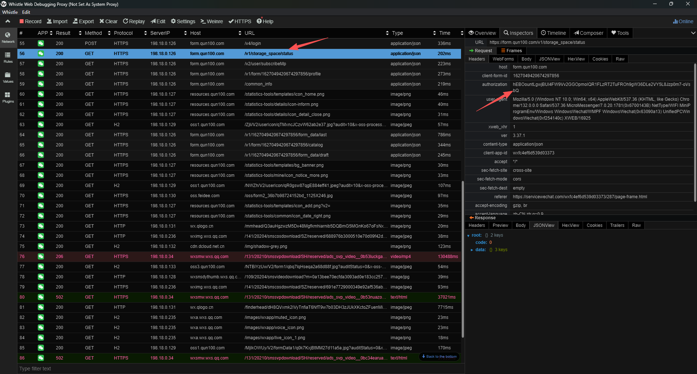

# 体育场地预约系统

一个自动化的体育场地预约工具，支持定时批量处理预约订单。

## 功能特性

- 🚀 **自动预约** - 自动处理待预约订单，支持指定日期、时段和场地
- ⏰ **定时调度** - 通过 crontab 实现每天 8:00 自动执行
- ⚡ **并发处理** - 支持同时处理多个预约订单
- 📝 **订单管理** - 订单状态追踪（待处理/成功/失败）
- 📊 **日志记录** - 完整的操作日志，方便问题排查
- 🔧 **配置灵活** - 通过 YAML 配置用户信息和数据库路径

## 项目结构

```
sports_ordering/
├── config.yaml          # 配置文件 (生成)
├── Makefile             # 构建脚本
├── sports-order         # 编译后的可执行文件 (生成)
├── database/
│   ├── init.sql         # 数据库初始化脚本
│   └── add_order.sh     # 交互式订单管理脚本
├── image/               # 文档图片
├── package_data/        # 抓包数据样本
│   ├── catalog.json
│   └── profile.json
└── source/
    ├── main.go          # 程序入口
    ├── api.go           # HTTP 客户端
    ├── repository.go    # 数据库操作层
    ├── booking_test.go  # API 集成测试
    ├── go.mod           # Go 模块配置
    ├── go.sum
    ├── common/          # 公共模块
    │   ├── constants.go # 常量定义
    │   ├── interfaces.go# 接口定义
    │   ├── models.go    # 数据模型
    │   └── types.go     # 类型定义
    └── service/         # 业务服务层
        ├── booking_service.go  # 预约服务
        ├── catalog_service.go  # 目录服务
        └── order_service.go    # 订单处理服务
```

## 环境要求

- Go 1.22+
- SQLite3
- Make

## 环境依赖安装

```bash
# 安装 Go、SQLite3、Make 和 GCC
sudo apt update
sudo apt install -y golang-go sqlite3 make gcc
```

验证安装：

```bash
go version      # 应显示 go1.22 或更高版本
sqlite3 --version
make --version
gcc --version
```

> ⚠️ **注意**：本项目使用 `go-sqlite3` 驱动，需要 CGO 支持，因此必须安装 GCC 编译器。

## 快速开始

### 1. 克隆项目

```bash
git clone <repository-url>
cd sports_ordering
```

### 2. 初始化项目

一键生成配置文件并初始化数据库：

```bash
make init
```

### 3. 配置用户信息

编辑 `config.yaml` 文件，填写你的个人信息（详细抓包教程见下文）：

```yaml
# 用户配置
user:
  student_id: "你的学号"
  ...
  token: ""        # 认证令牌
```

### 4. 编译程序

```bash
make build
```

### 5. 添加预约订单

使用交互式脚本管理订单：

```bash
make add-order
```

脚本提供以下功能：
- **添加单个订单** - 输入日期、时段、场地
- **查看待处理订单** - 显示状态为 PENDING 的订单
- **查看所有订单** - 显示全部订单历史
- **删除订单** - 按 ID 删除指定订单
- **批量添加订单** - 一次性添加连续时段的多个订单

也可以直接使用 SQL 插入：

```sql
INSERT INTO orders (date, hour, venue, status) VALUES
('2025-12-16', 15, 4, 'PENDING'),  -- 12月16日 15:00-16:00 4号场地
('2025-12-16', 16, 4, 'PENDING');  -- 12月16日 16:00-17:00 4号场地
```

### 6. 配置定时任务

预约系统通常在每天早上 8:00 开放，需要通过 crontab 实现定时调度。

编辑 crontab：

```bash
crontab -e
```

添加定时任务（每天 8:00 执行）：

```cron
0 8 * * * cd /path/to/sports_ordering && ./sports-order >> /var/log/sports-order.log 2>&1
```

> 💡 **说明**：
> - 将 `/path/to/sports_ordering` 替换为项目的实际绝对路径
> - 日志输出到 `/var/log/sports-order.log`，可根据需要修改
> - 程序会自动处理「当天 + 2 天」的待预约订单

## Makefile 命令

| 命令 | 说明 |
|------|------|
| `make help` | 显示帮助信息 |
| `make init` | 初始化项目（配置 + 数据库） |
| `make build` | 编译 Go 程序 |
| `make test` | 运行 API 集成测试 |
| `make add-order` | 交互式订单管理 |

## 测试说明

运行 `make test` 会执行 API 集成测试，测试流程如下：

1. **读取配置** - 从 `config.yaml` 加载用户信息和 token
2. **获取 Catalog** - 调用真实 API 获取可预约的日期、时段和场地列表
3. **尝试预定** - 选择最后一天的最晚时段（如 2025-12-22 21:00-22:00）发起预约请求
   - 选择较晚的时段是为了避免测试时真的预约成功

### Token 无效时的输出

```
=== RUN   TestReadCatalogAndBook
    booking_test.go:40: 用户: 张三 (学号: 20231234567)
    booking_test.go:42: 警告: Token 为空，预定请求将会失败
    ...
    booking_test.go:111: 预定失败: 提交预约请求失败: HTTP 401: 401  - {"code":13552,"message":"会话超时，请重新登录"}
--- PASS: TestReadCatalogAndBook (0.76s)
```

### Token 有效时的输出

```
=== RUN   TestReadCatalogAndBook
    booking_test.go:40: 用户: 张三 (学号: 20231234567)
    booking_test.go:49: 
        === Step 1: 从真实 API 读取 Catalog ===
    booking_test.go:55: 表单版本: 246
    booking_test.go:56: 可用场地: 6 个
    booking_test.go:57: 可预约日期: 7 天
    ...
    booking_test.go:103: 尝试预定:
    booking_test.go:104:   日期: 2025-12-22
    booking_test.go:105:   时段: 21:00-22:00
    booking_test.go:106:   场地: 1号
    booking_test.go:111: 预定失败: 提交预约请求失败: HTTP 422: 422  - {"code":17936,...,"message":"您选择的时段未开放预约"}
--- PASS: TestReadCatalogAndBook (0.50s)
```

> 💡 **说明**：即使 token 有效，由于选择的是较远日期的时段，预约也会因为「您选择的时段未开放预约」而失败，这是预期行为。

## 数据库表结构

### orders 订单表

| 字段 | 类型 | 说明 |
|------|------|------|
| id | INTEGER | 订单ID（主键） |
| date | TEXT | 预约日期 (YYYY-MM-DD) |
| hour | INTEGER | 预约时段（小时，如 15 表示 15:00-16:00） |
| venue | INTEGER | 场地编号（默认 4） |
| status | TEXT | 订单状态：PENDING/SUCCESS/FAILED |
| created_at | DATETIME | 创建时间 |
| updated_at | DATETIME | 更新时间 |

### logs 日志表

| 字段 | 类型 | 说明 |
|------|------|------|
| id | INTEGER | 日志ID（主键） |
| level | TEXT | 日志级别：INFO/WARN/ERROR |
| message | TEXT | 日志消息 |
| order_id | INTEGER | 关联订单ID（可为空） |
| created_at | DATETIME | 创建时间 |

## 查看日志

系统日志分为**运行输出日志**和**数据库业务日志**两部分。

### 1. 运行输出
- **手动运行**: 直接显示在终端。
- **定时任务**: 默认输出到 `/var/log/sports-order.log` (取决于 crontab 配置)。

### 2. 数据库业务日志
系统会将详细的业务操作记录（如预约请求、结果状态）存储在数据库的 `logs` 表中。

#### 命令行查看
```bash
sqlite3 sports-order.db "SELECT * FROM logs ORDER BY created_at DESC LIMIT 20;"
```

#### VS Code 查看 (推荐)
如果你习惯使用 VS Code，可以使用 **SQLite Viewer** 插件进行可视化查看：
1. 在 VS Code 扩展商店搜索并安装 `SQLite Viewer`。
2. 在资源管理器中点击 `sports-order.db` 文件。
3. 选择 `logs` 表，即可清晰地浏览、筛选和查询日志数据。

## 工作原理

本工具通过模拟微信小程序的前端请求来实现自动化预订。核心逻辑分为三步：

1.  **获取场地和时段信息 (GET请求)**
    *   程序首先会向服务器发送一个 `GET` 请求，以获取最新的可预订日期、时段和场地列表（即 Catalog）。
    *   这个请求返回的数据中，包含了每个具体可预订项的唯一标识符 `cid`。`cid` 是后续提交预订请求的关键参数。

2.  **构建预订请求参数 (POST请求)**
    *   程序会解析上一步获取到的 Catalog 数据，根据数据库中待处理订单的日期、小时和场地要求，查找并匹配到对应的 `cid`。
    *   同时，程序会从 `config.yaml` 文件中读取用户信息（如学号、姓名）和认证 `token`。
    *   最后，将 `cid`、用户信息和 `token` 等所有必需参数组合成一个复杂的 JSON 对象，作为 `POST` 请求的 Body。

3.  **发送最终预订请求 (POST请求)**
    *   程序将构建好的 JSON 数据以 `POST` 方式发送到预订接口。
    *   服务器会根据提交的数据验证并执行预订操作。程序会根据 HTTP 响应码和返回的 Body 内容来判断预订是否成功，并相应地更新数据库中的订单状态。

### 关于 Token

`token` 是认证用户身份的关键凭证，其获取过程相对复杂。

**Token 生成逻辑**:
1.  当微信小程序本地缓存的 `token` 过期后，它会首先从微信获取一个临时的、单次有效的登录凭证（code）。
2.  随后，小程序会向其业务服务器的 `/v4/login` 接口发送一个 `POST` 请求，将这个临时凭证作为参数。
3.  服务器验证通过后，会返回一个新的 `token`，这个新 `token` 的有效期大约是 **48小时**。
4.  之后的所有业务请求（如获取场地列表、提交预订）都会在请求头（Header）中携带这个新的 `token`。

**获取方法**:
*   我们真正需要抓取并配置到 `config.yaml` 文件中的，是第 4 步中业务请求所携带的那个 **48小时有效期的 `token`**。
*   推荐使用 `Whistle`、`Charles` 或 `Fiddler` 等网络抓包工具。最简单的方式是**直接在电脑上进行操作**：
    1.  在电脑上安装并配置好抓包工具。
    2.  直接使用 **微信PC客户端** 打开目标小程序。
    3.  抓包工具即可捕获到小程序发出的网络请求。
*   **HTTPS抓包提示**: 启用 HTTPS 抓包需要**在你的电脑上**安装并信任抓包工具提供的根证书。具体步骤请参考你所选工具的官方文档。



**注意事项**:
*   `token` 过期后，程序将无法成功预订，需要重新抓包获取并更新到 `config.yaml`。

## 开发说明

本项目包含一些辅助开发的说明和数据。

*   `package_data/catalog.json`: 这是一个 `GET` 请求的响应体抓包样本。它展示了服务器返回的场地、日期和时段等信息的完整结构，开发者可以基于此文件进行解析逻辑的编写和调试，而无需每次都实时请求线上接口。
*   **POST请求分析**: 在实际开发中，除了分析 `GET` 请求外，还需要抓取一次成功的**预订 `POST` 请求**。通过分析该请求的 Body 结构，才能正确地构建出 `booking_service.go` 中发送给服务器的最终 JSON 数据。

## 免责声明

本项目仅供学习和技术研究使用。

使用自动化脚本在资源有限的公共平台上进行预订，可能会对其他手动操作的用户造成不公平。此外，多数平台的服务条款明确禁止使用自动化工具。

请在了解并承担相关风险（包括但不限于账号被限制）的前提下，自行决定是否使用。开发者对使用本项目所产生的任何后果不承担责任。